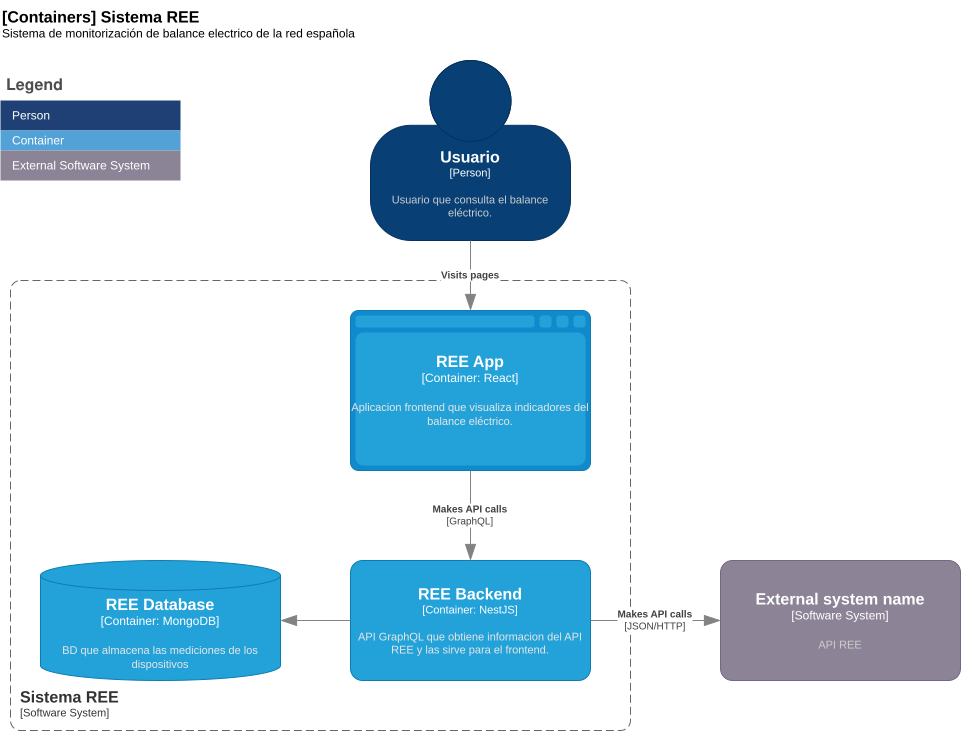
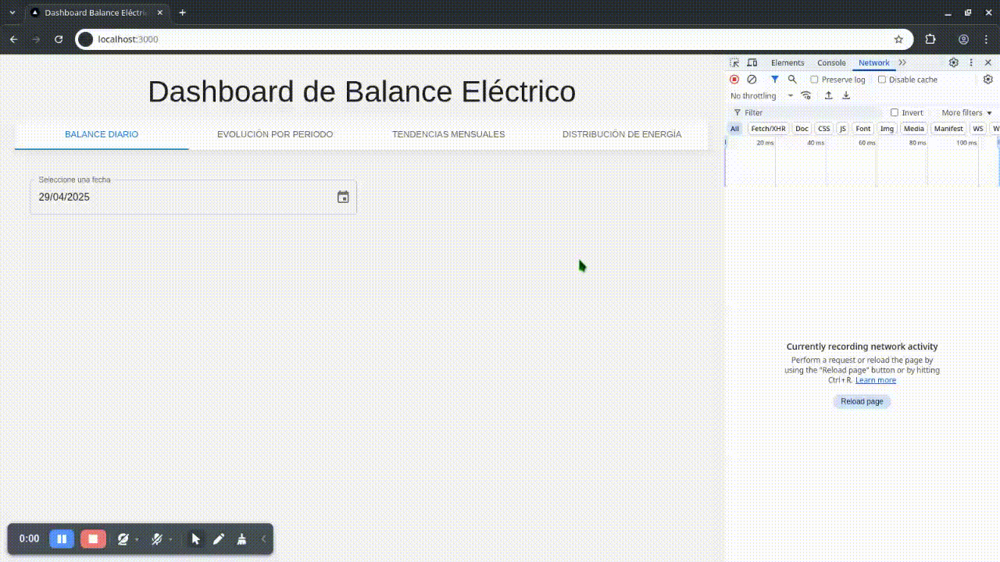

# ree-project

Sistema de monitorización de balance electrico de la red española.

## Arquitectura

### Diagrama de Nivel 2



## Pipeline de datos y modelo de datos

El pipeline de datos es un componente "Cron" de NestJS que se encarga de la extracción, transformación y carga de datos de la API de REE hacia la BD Mongo, la colección que contiene estos datos es `electric_balance`.

Esta colección tiene los siguientes campos:

| Campo | Descripción |
| --- | --- |
| `date` | Fecha del registro, hay uno por cada día |
| `energy_type` | Tipo de energía |
| `device_type` | Tipo de dispositivo |
| `value` | Valor del balance |
| `percentage` | Porcentaje del balance |

> Nota: El pipeline se ejecuta cada minuto, según la configuración del cronjob, actualiza el documento del dia en ejecución.

Adicional a esta colección, se tiene la colección `ree_entities` que contiene los tipos de energía y dispositivo.

| Campo | Descripción |
| --- | --- |
| `energy_type` | Tipo de energía |
| `device_type` | Tipo de dispositivo |

Esto sirve para poder filtrar los registros desde el frontend.

## Construccion del sistema

Para la construccion del sistema se requiere de Docker y Docker Compose.

Se ejecuta mediante el siguiente comando:

```bash
docker-compose -f docker/docker-compose.yml build
```

- Backend:
    - Se compila el proyecto y genera el bundle.
    - Se crea la imagen del backend.

- Frontend:
    - Se compila el proyecto y genera el bundle.
    - Se crea la imagen del frontend.

## Ejecución del sistema

Se ejecuta mediante el siguiente comando:

```bash
docker-compose -f docker/docker-compose.yml up
```

Con esto se realiza lo siguente:
- MongoDB:
    - Se descarga la imagen de MongoDB
    - Se crea el contenedor
    - Se inicia el contenedor
    - Se restauran las 2 colecciones de la base de datos.

- Backend:
    - Se crea/levanta el contenedor

- Frontend:
    - Se crea/levanta el contenedor

> Nota: Se tiene como backup de la base de datos el archivo `backup/ree-balance.electric_balance.json` y `backup/ree-balance.ree_entities.json`. El primero contiene los registros de balance eléctrico desde Abril del 2024, aunque no todos los dispositivos tienen registros.

## Funcionamiento

demo
